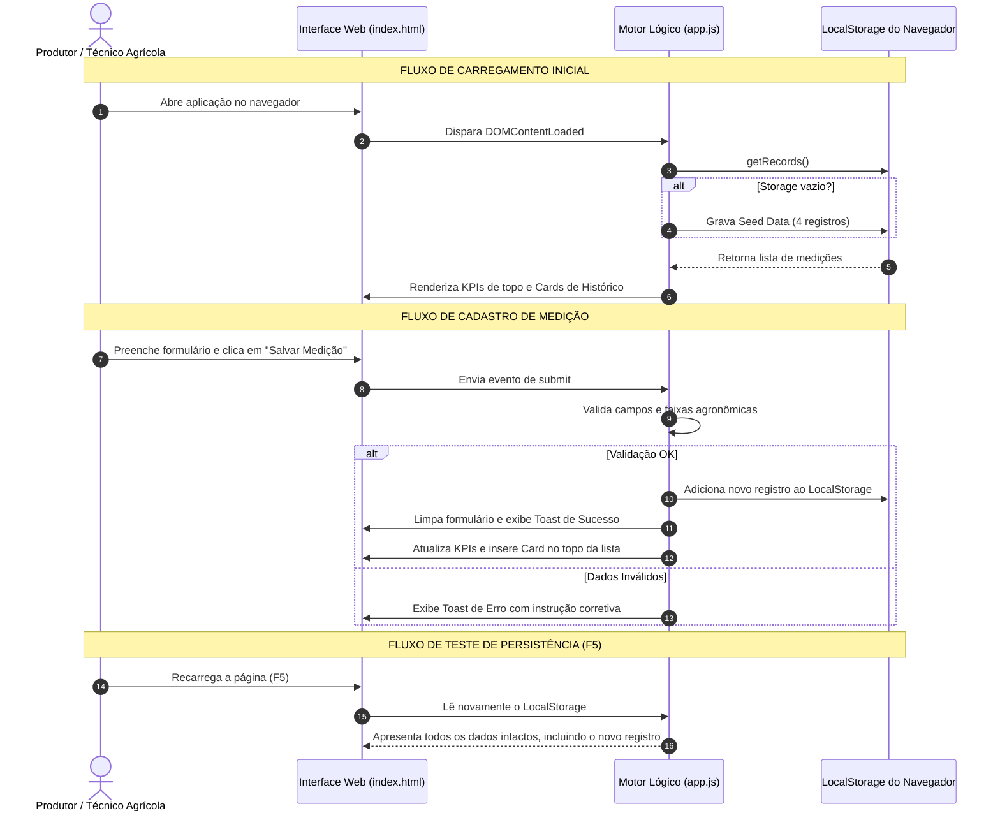

# 🏗️ Conecta Agro — Estrutura Completa do Projeto

> **Status:** Blueprint Arquitetural e Especificação de Componentes  
> **Versão:** 1.0.0  
> **Objetivo:** Mapear toda a anatomia técnica, árvore de arquivos, modelo de dados, fluxos de interface e responsabilidades de cada camada do software.

---

## 1. Visão Geral da Arquitetura

O **Conecta Agro** é uma aplicação web autônoma *client-side*, projetada para rodar diretamente em navegadores modernos (desktop e mobile), sem necessidade de servidores pagos, dependências pesadas de compilação ou conexões externas obrigatórias.

```
┌────────────────────────────────────────────────────────────────────────┐
│                        CONECTA AGRO APPLICATION                        │
│                                                                        │
│   ┌────────────────────────────────────────────────────────────────┐   │
│   │               CAMADA DE APRESENTAÇÃO (UI / UX)                 │   │
│   │   • index.html (Semântica, acessibilidade e containers)        │   │
│   │   • style.css (Layout responsivo, grid, animações de campo)    │   │
│   │   • design-system.css (Tokens, paleta Raiz & Precisão)         │   │
│   └───────────────────────────────┬────────────────────────────────┘   │
│                                   │                                    │
│   ┌───────────────────────────────▼────────────────────────────────┐   │
│   │                CAMADA LÓGICA DO CLIENTE (app.js)               │   │
│   │   • State Management (Array de medições em memória)            │   │
│   │   • Validação Agronômica (Faixas de umidade e temperatura)     │   │
│   │   • Motor de Filtros e Busca em Tempo Real                     │   │
│   │   • Motor de KPIs (Recálculo dinâmico de médias e alertas)     │   │
│   │   • Renderizador Dinâmico de Cards e Badges                    │   │
│   │   • Sistema de Toasts (Notificações táteis)                    │   │
│   └───────────────────────────────┬────────────────────────────────┘   │
│                                   │                                    │
│   ┌───────────────────────────────▼────────────────────────────────┐   │
│   │                CAMADA DE PERSISTÊNCIA LOCAL                    │   │
│   │   • window.localStorage ('conecta_agro_medicoes_v1')           │   │
│   │   • Carga inicial de demonstração (Seed Data automática)       │   │
│   └────────────────────────────────────────────────────────────────┘   │
└────────────────────────────────────────────────────────────────────────┘
```

---

## 2. Árvore de Diretórios e Arquivos

Abaixo está a estrutura exata do repositório com o papel detalhado de cada componente:

```
c:\Users\Gusta\Conecta Agro\
├── 📄 README.md                 # Visão geral, índice do repositório e atalhos rápidos
├── 📋 PROJETO_CONECTA_AGRO.md    # Documento de concepção original, escopo e modelo de entrega
├── 🎨 DESIGN_SYSTEM.md          # Manifesto visual, paleta Raiz & Precisão, tipografia e tokens
├── 🏗️ ESTRUTURA_DO_PROJETO.md    # [ESTE ARQUIVO] Blueprint de arquitetura, dados e componentes
│
├── 🎨 design-system.css         # Variáveis CSS globais (:root) e componentes base do Design System
├── 💻 design-system.html        # Vitrine / Styleguide interativa para inspeção visual dos componentes
│
├── 🌐 index.html                # Aplicação web principal do Conecta Agro
├── 💅 style.css                 # Estilos específicos do layout, grid responsivo e painéis
└── ⚙️ app.js                    # Lógica da aplicação: formulário, validação, storage e filtros
```

---

## 3. Especificação Detalhada dos Arquivos da Aplicação

### 3.1 `index.html` (Interface Principal)
Deve conter a estrutura semântica dividida em 5 blocos estratégicos:

1. **Cabeçalho Superior (`<header>` / Topbar):**
   * Logotipo e assinatura visual (`🌱 Conecta Agro • Raiz & Precisão`).
   * Tag de status de conexão: `Modo Local Ativo • Persistência no Navegador`.
   * Data atual formatada por extenso.
   * Botão de ação rápida para restaurar dados de demonstração (*Demo Seed*).

2. **Faixa de Métricas Rápidas (`<section class="kpi-banner">`):**
   * Card 1: **Total de Medições Registradas** (Contador numérico).
   * Card 2: **Umidade Média do Solo** (Média percentual com barra indicativa).
   * Card 3: **Temperatura Média** (Média em °C).
   * Card 4: **Talhões em Alerta / Crítico** (Contador de atenção fitossanitária com badge de alerta).

3. **Área de Trabalho Principal (`<main class="main-layout">`):**
   * Dividida em grid de duas colunas (Desktop) ou empilhada (Mobile/Tablet):
     * **Coluna Esquerda — Formulário de Registro (`<section class="form-section">`):**
       * Título: `Nova Medição de Campo`.
       * Campo Data e Hora (com preenchimento automático da hora atual).
       * Campo Talhão / Lote (com sugestões via datalist ou seleção rápida).
       * Campo Cultura / Variedade (Ex.: Milho Safrinha, Soja BMX, Café Catuaí).
       * Campo Umidade do Solo (`%`) com limites de validação (0% a 100%).
       * Campo Temperatura Ambiente (`°C`) com limites de validação (-10°C a 60°C).
       * Seletor de Nível de Pragas/Doenças (Chips selecionáveis ou select estilizado: *Normal*, *Atenção*, *Alerta*, *Crítico*).
       * Campo de Observações do Manejo (Textarea com orientações de campo).
       * Botões de Ação: `💾 Salvar Medição` (Primário) e `🔄 Limpar Campos` (Secundário).
     * **Coluna Direita — Painel de Histórico e Consulta (`<section class="records-section">`):**
       * Barra de Controle Superior:
         * Input de busca rápida por texto (filtra por nome do talhão ou cultura).
         * Seletor de filtro por status de risco (*Todos*, *Normal*, *Atenção*, *Alerta*, *Crítico*).
         * Contador de registros visíveis (Ex.: `Exibindo 4 de 4 medições`).
       * Contêiner dinâmico da lista de registros (`<div id="records-list">`):
         * Exibição em cards ricos ou tabela responsiva.
         * Cada item exibe: Talhão, Cultura, Data/Hora, Badge de Alerta colorida, Mini-cards de Umidade e Temperatura, Observação de manejo e botão para remover medição individual.
       * Estado Vazio (*Empty State*): Mensagem amigável quando nenhum registro for encontrado para os filtros aplicados.

4. **Contêiner de Notificações Flutuantes (`<div id="toast-container">`):**
   * Balões de confirmação (*Toasts*) animados que surgem no canto superior/inferior confirmando ações ("Medição salva com sucesso!").

5. **Rodapé Institucional (`<footer>`):**
   * Informações sobre o projeto acadêmico/institucional, aviso de armazenamento local sem custos e versão da aplicação.

---

### 3.2 `style.css` (Design, Layout & Responsividade)
Complementa o `design-system.css`, garantindo que a aplicação seja fluida e ergonômica:

* **Grid Responsivo:**
  * Desktop (`>= 1024px`): Layout em 2 colunas proporcionais (Formulário 42% / Histórico 58%).
  * Tablet (`768px - 1023px`): Layout híbrido com campos lado a lado.
  * Mobile (`< 768px`): Layout em coluna única, priorizando o formulário no topo e histórico logo abaixo, botões com altura mínima de 48px para facilitar o toque com o polegar.
* **Microinterações:**
  * Efeito de foco elevado nos inputs (`ring` com a cor da marca).
  * Animação de entrada suave (`fade-in` e `slide-up`) ao adicionar novos cards à lista.
  * Pulso suave na badge de status quando o risco for classificado como **Crítico**.

---

### 3.3 `app.js` (Lógica da Aplicação)
Estruturado de forma modular e limpa:

#### A. Modelo de Dados (Objeto de Medição)
```javascript
{
  id: "ca_1728312000000_abc",       // String única gerada no momento da criação
  dateTime: "2026-10-07T11:30",      // ISO string ou datetime-local
  field: "Talhão 04 - Setor Norte",  // Nome ou identificação da área
  crop: "Milho Safrinha DKB",        // Cultura implantada
  soilMoisture: 28.0,                // Número float (0 a 100)
  temperature: 31.5,                 // Número float em graus Celsius
  pestStatus: "alert",               // "safe" | "warn" | "alert" | "danger"
  observations: "Presença inicial de lagarta do cartucho na bordadura leste.",
  createdAt: 1728312000000           // Timestamp para ordenação decrescente
}
```

#### B. Módulos Internos de Execução
1. **`StorageService`:**
   * `KEY`: `'conecta_agro_records_v1'`.
   * `getRecords()`: Lê e faz parse do JSON do `localStorage`. Se vazio, inicializa com os dados iniciais fictícios (*Seed*).
   * `saveRecords(records)`: Converte em string e persiste no `localStorage`.
   * `addRecord(record)`: Adiciona o novo registro no início do array e salva.
   * `deleteRecord(id)`: Remove um registro pelo ID e atualiza a persistência.
   * `resetToDefaultSeed()`: Restaura o conjunto de 4 medições fictícias ricas para demonstração.

2. **`ValidationService`:**
   * Garante que campos obrigatórios (Talhão, Cultura, Umidade, Temperatura e Data) estejam preenchidos.
   * Valida se a umidade está estritamente entre `0` e `100%`.
   * Valida se a temperatura está entre `-10` e `60°C`.
   * Retorna mensagens de erro específicas para exibição imediata no Toast.

3. **`MetricsService`:**
   * Calcula o total de medições cadastradas.
   * Calcula a média aritmética de umidade do solo.
   * Calcula a média aritmética de temperatura.
   * Conta quantos talhões estão com status `alert` ou `danger`.
   * Atualiza os 4 cards de KPI no DOM.

4. **`RenderService`:**
   * Converte a lista de registros filtrada em elementos HTML usando os tokens do Design System.
   * Formata datas para o padrão brasileiro (`07/10/2026 às 11:30`).
   * Aplica a badge e a cor correta de acordo com o `pestStatus`.
   * Trata o caso de lista vazia com mensagem orientativa.

5. **`UIController` (Event Listeners):**
   * Captura o envio do formulário (`submit`).
   * Captura inputs de busca textual e mudanças no filtro de status.
   * Controla a exibição e fechamento automático de Toasts (3 segundos de duração).
   * Preenche a data/hora atual por padrão ao carregar a página.

---

## 4. Conjunto de Dados Fictícios Iniciais (*Seed Data*)

Para que o protótipo possa ser avaliado imediatamente sem exigir que o avaliador digite dados antes de ver o resultado, a aplicação iniciará com 4 medições realistas pré-configuradas:

| ID | Talhão / Lote | Cultura | Umidade | Temp | Status | Observações |
| :--- | :--- | :--- | :--- | :--- | :--- | :--- |
| **01** | *Talhão 04 - Setor Norte* | Milho Safrinha DKB | `28.0%` | `31.5°C` | 🟠 Alerta (Médio) | Presença inicial de lagarta do cartucho na bordadura leste; monitorar seletivamente. |
| **02** | *Talhão 01 - Baixada* | Soja Intacta BMX | `42.5%` | `27.2°C` | 🟢 Normal | Boa umidade após irrigação noturna. Folhagem saudável sem sinais de pragas. |
| **03** | *Talhão 08 - Colina Sul* | Café Arábica Catuaí | `18.0%` | `34.0°C` | 🔴 Crítico | Estresse hídrico severo e manchas de bicho-mineiro em expansão. Irrigação emergencial requisitada. |
| **04** | *Talhão 03 - Pivô Central* | Feijão Carioca | `36.0%` | `28.5°C` | 🟡 Atenção | Pequenos focos de mosca-branca observados na reboleira central. Avaliar defensivo biológico. |

---

## 5. Roteiro de Fluxos do Usuário (User Flows)



---

## 6. Checklist de Validação Técnica e Entrega

Este checklist garante conformidade integral com as instruções da oficina:

- [x] **Identificação clara:** Problema, usuário e função principal documentados em `PROJETO_CONECTA_AGRO.md`.
- [x] **Design System completo:** Paleta de cores, tipografia e diretrizes de campo em `DESIGN_SYSTEM.md` e `design-system.css`.
- [x] **Vitrine interativa:** Componentes visualizados em `design-system.html`.
- [x] **Estrutura arquitetural:** Blueprint detalhado de arquivos e dados em `ESTRUTURA_DO_PROJETO.md`.
- [ ] **Interface Web executável:** `index.html` e `style.css` criados e testados.
- [ ] **Lógica e persistência:** `app.js` com manipulação de `localStorage` e recálculo de métricas.
- [ ] **Teste de persistência com F5:** Testar salvamento e garantia de persistência sem perda de dados.
- [ ] **Relatório de evidências:** Roteiro pronto para preenchimento com capturas de tela e reflexões.
