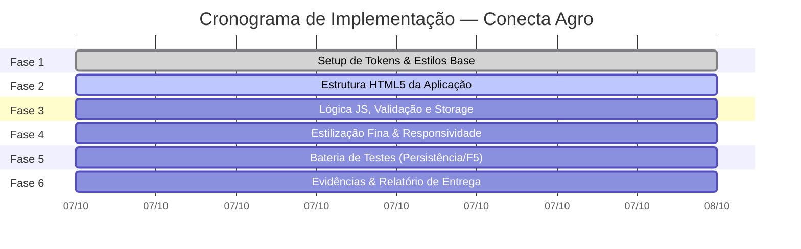

# 📋 Conecta Agro — Plano de Implementação

> **Status:** Aprovado para Execução  
> **Metodologia:** Desenvolvimento Iterativo por Fases com Validação Contínua  
> **Data de Planejamento:** 07 de Outubro de 2026  
> **Objetivo:** Guiar a construção, testes e entrega da aplicação web Conecta Agro com base no [PROJETO_CONECTA_AGRO.md](file:///c:/Users/Gusta/Conecta%20Agro/PROJETO_CONECTA_AGRO.md), no [DESIGN_SYSTEM.md](file:///c:/Users/Gusta/Conecta%20Agro/DESIGN_SYSTEM.md) e no [ESTRUTURA_DO_PROJETO.md](file:///c:/Users/Gusta/Conecta%20Agro/ESTRUTURA_DO_PROJETO.md).

---

## 1. Visão Geral das Fases de Execução



---

## 2. Detalhamento das Fases

### 🟩 FASE 1: Fundação & Integração do Design System
* **Objetivo:** Garantir que toda a identidade visual *Raiz & Precisão* esteja acessível e pronta para consumo.
* **Tarefas:**
  - [x] Criação de `DESIGN_SYSTEM.md` com tokens de cores, tipografia e diretrizes de campo.
  - [x] Criação de `design-system.css` com as variáveis `:root` (`--ca-*`) e classes base de botões, badges e inputs.
  - [x] Criação da vitrine interativa `design-system.html` para inspeção visual dos componentes.
  - [ ] Preparação do arquivo `style.css` importando `design-system.css` e estruturando o layout da aplicação.
* **Critério de Aceite da Fase:**
  - Classes de estilo prontas para uso sem inconsistências visuais ou dependências externas não declaradas.

---

### 🟩 FASE 2: Construção da Estrutura Semântica da Interface (`index.html`)
* **Objetivo:** Implementar o documento HTML5 completo, acessível, semântico e organizado em seções estratégicas.
* **Tarefas:**
  - [ ] **Cabeçalho (Topbar):**
    - Logo com ícone e assinatura do Conecta Agro.
    - Indicador de status de persistência local (*"Modo Local Ativo"*).
    - Botão de atalho: *"Restaurar Dados Demo"*.
  - [ ] **Painel de KPIs de Campo (`kpi-banner`):**
    - Card de Total de Medições.
    - Card de Umidade Média do Solo (`%`).
    - Card de Temperatura Média (`°C`).
    - Card de Talhões em Alerta/Crítico com badge colorida.
  - [ ] **Área de Trabalho Principal (Grid Responsivo de 2 Colunas):**
    - **Coluna 1 — Formulário de Medição de Campo:**
      - Campo `Data e Hora` (`datetime-local`).
      - Campo `Talhão / Lote` com datalist de talhões frequentes.
      - Campo `Cultura / Variedade`.
      - Campo `Umidade do Solo (%)` com indicador de porcentagem.
      - Campo `Temperatura Ambiente (°C)` com indicador de graus.
      - Seletor visual de `Nível de Pragas/Doenças` (Normal, Atenção, Alerta, Crítico).
      - Campo `Observações e Ações de Manejo` (`textarea`).
      - Botões de ação: `Salvar Medição` (Primário) e `Limpar` (Secundário).
    - **Coluna 2 — Painel de Histórico e Consulta:**
      - Barra de pesquisa textual instantânea (filtro por Talhão e Cultura).
      - Filtro por nível de risco fitossanitário (*Todos*, *Normal*, *Atenção*, *Alerta*, *Crítico*).
      - Contador de medições visíveis (*"Exibindo X de Y registros"*).
      - Container dinâmico para renderização dos cards de medição.
      - *Empty state* amigável para quando nenhum registro corresponder à busca.
  - [ ] **Sistema de Notificações Toast:**
    - Container flutuante para mensagens de confirmação e alertas.
  - [ ] **Rodapé:**
    - Informações de conformidade com a atividade acadêmica.
* **Critério de Aceite da Fase:**
  - HTML válido, IDs descritivos e únicos para cada elemento interativo, acessibilidade para leitores de tela e estrutura pronta para vinculação do script.

---

### 🟩 FASE 3: Desenvolvimento da Camada Lógica do Cliente (`app.js`)
* **Objetivo:** Criar o motor funcional de gerenciamento de estado, validação, persistência e manipulação do DOM.
* **Tarefas:**
  - [ ] **Módulo de Armazenamento (`StorageService`):**
    - Configurar chave `conecta_agro_records_v1` no `localStorage`.
    - Implementar inicialização com *Seed Data* (4 registros realistas pré-configurados) caso o storage esteja vazio.
    - Funções de leitura (`getRecords`), gravação (`saveRecords`), adição (`addRecord`), remoção (`deleteRecord`) e reset (`resetDemoSeed`).
  - [ ] **Módulo de Validação Agronômica (`ValidationService`):**
    - Checagem de obrigatoriedade dos campos principais.
    - Validação de limites reais do campo:
      * Umidade do solo entre `0%` e `100%`.
      * Temperatura entre `-10°C` e `60°C`.
    - Mensagens amigáveis de retorno em caso de preenchimento inválido.
  - [ ] **Módulo de Métricas e KPIs (`MetricsService`):**
    - Recálculo reativo da média de umidade, temperatura média e quantidade de alertas ativos a cada inserção ou exclusão.
    - Atualização instantânea dos números no cabeçalho.
  - [ ] **Módulo de Filtros e Busca em Tempo Real:**
    - Filtragem combinada: texto digitado + chip de status selecionado.
  - [ ] **Módulo de Renderização (`RenderService`):**
    - Geração dinâmica dos cards de medição contendo dados formatados (padrão brasileiro de data/hora), badges coloridas de alerta com pulso no estado crítico e botão de exclusão.
  - [ ] **Módulo de Feedback Visual (`ToastService`):**
    - Exibição de alertas temporários (3 segundos) para confirmação de salvamento, remoção e erros.
* **Critério de Aceite da Fase:**
  - Fluxo completo de cadastro, salvamento, listagem e filtros funcionando sem erros no console JavaScript.

---

### 🟩 FASE 4: Estilização do Layout, Microinterações e Responsividade (`style.css`)
* **Objetivo:** Aplicar os estilos do Design System, garantindo experiência refinada no desktop e no celular.
* **Tarefas:**
  - [ ] Implementação do grid de 2 colunas com proporção harmoniosa (42% formulário / 58% histórico) em desktop.
  - [ ] Adaptação para coluna única em telas mobile (`< 768px`).
  - [ ] Áreas de toque confortáveis (mínimo de 46-48px de altura em botões e inputs para uso no campo).
  - [ ] Microinterações de foco nos inputs (`outline` temático esmeralda/folha) e animações suaves de entrada dos cards (`slide-up`).
  - [ ] Destaque visual pulsante na badge de risco **Crítico**.
* **Critério de Aceite da Fase:**
  - Interface visualmente impressionante, alto contraste sob iluminação forte e layout 100% responsivo em qualquer resolução de tela.

---

### 🟩 FASE 5: Bateria de Testes e Validação Técnica
* **Objetivo:** Executar todos os testes previstos no roteiro de testes da oficina.
* **Casos de Teste Obrigatórios:**
  | ID | Descrição do Teste | Procedimento | Resultado Esperado |
  | :--- | :--- | :--- | :--- |
  | **TC-01** | Carga Inicial (*Seed*) | Abrir a página pela primeira vez | Exibir 4 registros fictícios e KPIs calculados. |
  | **TC-02** | Cadastro com Sucesso | Preencher medição do *Talhão 02* e salvar | Toast de sucesso, formulário limpo, novo card no topo e KPIs atualizados. |
  | **TC-03** | Validação de Limites | Informar umidade de `150%` ou temperatura de `80°C` | Bloquear envio e alertar o usuário sobre o limite válido. |
  | **TC-04** | **Teste Crítico de Persistência** | Pressionar `F5` / Recarregar a página | Todos os dados cadastrados devem permanecer intactos via LocalStorage. |
  | **TC-05** | Filtro de Busca | Digitar `"Soja"` ou selecionar status `"Alerta"` | A lista deve exibir apenas os registros compatíveis instantaneamente. |
  | **TC-06** | Exclusão de Registro | Clicar no botão excluir de um card | Registro removido da tela e do LocalStorage com atualização dos KPIs. |
  | **TC-07** | Reset de Demonstração | Clicar em *"Restaurar Dados Demo"* | Reestabelecer o estado padrão com confirmação visual. |

---

### 🟩 FASE 6: Elaboração do Documento de Entrega (Relatório da Atividade)
* **Objetivo:** Organizar os dados e resultados para o relatório final de até 2 páginas exigido na atividade.
* **Estrutura do Relatório:**
  1. **Identificação e Proposta:** Nome, desafio escolhido (Conecta Agro), usuário e problema atendido.
  2. **Instruções Utilizadas:** O prompt inicial e os prompts de ajuste aplicados no Antigravity.
  3. **Evidências do Protótipo:** Roteiro de capturas de tela (prints do formulário, da lista de registros e do teste de persistência).
  4. **Teste e Reflexão:** Resultados observados, limitações (ex.: escopo local vs. nuvem/PWA) e melhorias futuras (sensores IoT e GPS).

---

## 3. Matriz de Dependências e Ordem de Ação Imediata

```
[FASE 1: Design System] ──► CONCLUÍDA ✅
       │
       ▼
[FASE 2: index.html] ─────► PRÓXIMO PASSO IMEDIATO 🚀
       │
       ▼
[FASE 3: app.js] ─────────► Implementação da Lógica & LocalStorage
       │
       ▼
[FASE 4: style.css] ──────► Refinamento do Layout & Responsividade
       │
       ▼
[FASE 5: Bateria Testes] ─► Execução e Validação Técnica
       │
       ▼
[FASE 6: Relatório Final] ─► Consolidação das Evidências de Entrega
```

---

## 4. Próxima Ação Recomendada

Iniciar imediatamente a execução da **Fase 2** e **Fase 3** criando:
1. `index.html` — A página da aplicação estruturada com todas as seções e componentes;
2. `style.css` — Estilização da aplicação integrando o Design System;
3. `app.js` — O cérebro da aplicação com a persistência e validação.
