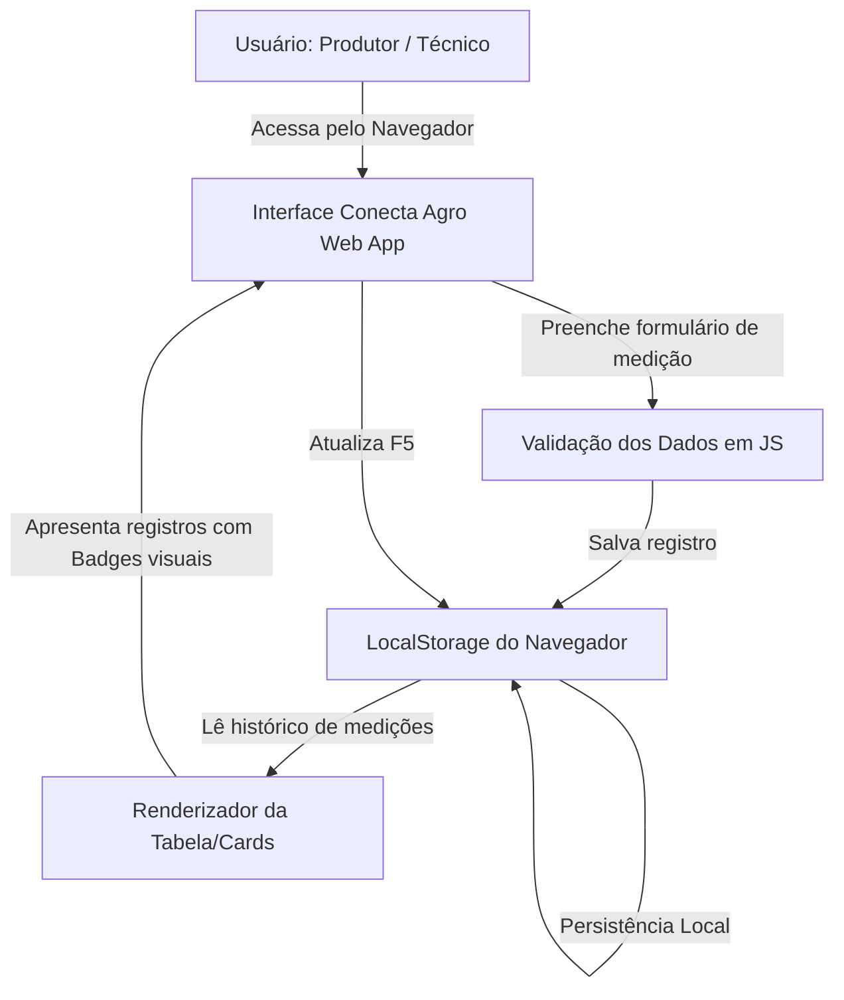

# Conecta Agro — Documento de Concepção e Especificação do Projeto

> **Status do Documento:** Base de Referência para Desenvolvimento e Entrega  
> **Área:** Agricultura Digital & Gestão de Informações de Campo  
> **Ambiente:** Antigravity IDE  

---

## 1. Identificação e Proposta do Projeto

### 1.1 Informações Gerais
* **Nome do Projeto:** Conecta Agro
* **Desafio Escolhido:** Registro de medições e observações de campo e consulta organizada dos dados agronômicos.
* **Usuário / Público-Alvo:** Produtores rurais (pequeno e médio porte), técnicos agrícolas e agrônomos de campo que realizam rondas diárias pelas lavouras.
* **Problema Atendido:** 
  Na rotina agrícola tradicional, medições de campo (como umidade do solo, temperatura e incidência de pragas) e anotações de manejo são comumente feitas em cadernetas de papel, anotações avulsas ou aplicativos de mensagens dispersos. Isso gera:
  1. Perda ou deterioração das anotações físicas devido à umidade e poeira do campo;
  2. Falta de histórico estruturado para comparar a evolução das lavouras talhão a talhão;
  3. Dificuldade de tomada de decisão rápida e preventiva diante do ataque inicial de pragas ou estresse hídrico.

### 1.2 Proposta de Valor
Desenvolver uma aplicação leve, intuitiva e funcional, com foco em usabilidade no campo, que permita ao profissional registrar rapidamente as medições essenciais de cada talhão e consultar o histórico completo de forma instantânea, com dados mantidos no próprio navegador de forma segura e sem custos de infraestrutura.

---

## 2. Instrução Inicial para o Antigravity (Prompt Base)

Seguindo rigorosamente a estrutura metodológica solicitada pela atividade, o comando de inicialização do protótipo é estruturado da seguinte forma:

```text
Quero criar um protótipo para o projeto Conecta Agro.
O usuário será o produtor rural ou técnico agrícola de campo e precisa registrar e consultar medições e observações de campo de forma rápida, prática e organizada no dia a dia da lavoura.
A função principal será registrar medições agronômicas e observações de campo e consultar esses dados em um histórico centralizado e ordenado.
O protótipo deverá permitir registrar [Data e Hora, Identificação do Talhão/Lote, Cultura/Variedade, Umidade do Solo (%), Temperatura Ambiente (°C), Nível de Alerta/Pragas (Nenhum, Baixo, Médio, Alto), Observações do Manejo] e consultar os registros em uma lista organizada, com destaques visuais para os níveis de alerta.
Utilize uma interface simples, moderna, em português, responsiva (focada em dispositivos móveis e desktop) e dados fictícios para demonstração. Não inclua serviços pagos ou integrações externas. Explique como executar e testar o resultado e informe como os dados serão armazenados (utilizando LocalStorage do navegador para garantir persistência local sem custos).
```

---

## 3. Especificação Funcional e Estrutura dos Dados

### 3.1 Função Principal
**Registro e Consulta Centralizada de Dados Agronômicos de Campo.**

### 3.2 Campos do Formulário de Registro
| Campo | Tipo de Entrada | Obrigatório? | Descrição / Exemplo |
| :--- | :--- | :--- | :--- |
| **Data e Hora** | Data/Hora (`datetime-local`) | Sim | Momento exato da leitura no campo (padrão: data/hora atual). |
| **Talhão / Lote** | Texto / Seleção | Sim | Identificação da área cultivada (Ex: *Talhão 04 - Setor Norte*). |
| **Cultura / Variedade** | Texto | Sim | Cultura implantada (Ex: *Milho Safrinha*, *Soja BMX*, *Café Arábica*). |
| **Umidade do Solo (%)** | Numérico (`0` a `100%`) | Sim | Medição da umidade da terra no ponto amostrado (Ex: *32%*). |
| **Temperatura (°C)** | Numérico (`-10` a `60°C`) | Sim | Temperatura no momento da ronda (Ex: *28.5°C*). |
| **Status de Pragas / Doenças** | Seleção (`Select`) | Sim | Classificação de risco: *Normal / Nenhuma*, *Atenção (Baixo)*, *Alerta (Médio)*, *Crítico (Alto)*. |
| **Observações e Ações** | Área de Texto (`Textarea`) | Não | Detalhes qualitativos (Ex: *Presença inicial de lagarta do cartucho na bordadura; recomendado monitoramento diário*). |

### 3.3 Visualização e Histórico
* **Lista Dinâmica de Registros:** Cards ou tabela responsiva com ordenação do mais recente para o mais antigo.
* **Badges de Alerta Coloridos:**
  * 🟢 Verde: Normal / Sem pragas / Umidade ideal
  * 🟡 Amarelo: Atenção / Risco baixo
  * 🟠 Laranja: Alerta / Risco médio
  * 🔴 Vermelho: Crítico / Ação imediata necessária
* **Filtros e Busca Rápida:** Filtro por talhão e por nível de risco para agilizar a consulta.
* **Resumo Rápido (Cards de Métricas):** Total de medições registradas, média de umidade e alertas críticos ativos.

---

## 4. Arquitetura e Decisões Técnicas



1. **Camada de Apresentação (UI):**
   * HTML5 semântico com tipografia legível e contraste adequado para visualização sob luz solar.
   * CSS3 moderno com tema visual agro (paleta em verde oliva, terra e grafite), microinterações nos botões e layout responsivo (adaptado para smartphones).
2. **Camada Lógica:**
   * JavaScript Vanilla puro, sem frameworks pesados, garantindo carregamento instantâneo mesmo com conexões lentas.
3. **Persistência de Dados:**
   * `window.localStorage`: Permite que qualquer registro cadastrado permaneça armazenado mesmo ao fechar ou recarregar a página (`F5`), dispensando a necessidade de banco de dados pago ou configuração de servidores externos.
4. **Dados de Demonstração (Seed Data):**
   * Inicialização automática com 3 a 5 registros fictícios na primeira execução, permitindo ao avaliador inspecionar o funcionamento antes mesmo de preencher o primeiro dado manual.

---

## 5. Roteiro de Testes e Validação de Funcionamento

Seguindo as orientações da oficina, o seguinte ciclo de testes deve ser executado no protótipo:

```text
[Etapa 1] Inserção de Dados Fictícios
  ↳ Preencher: Talhão 02, Cultura: Soja, Umidade: 26%, Temp: 31°C, Pragas: "Alerta (Médio)", Observação: "Início de desfolha na linha 15".
  
[Etapa 2] Salvar Registro
  ↳ Clicar em "Salvar Medição".
  ↳ Verificar se o formulário é limpo e recebe feedback de sucesso.

[Etapa 3] Validação na Consulta
  ↳ Confirmar se o novo registro apareceu no topo da lista com a badge correta (Laranja/Alerta).
  ↳ Confirmar cálculo correto das métricas no topo.

[Etapa 4] Teste Crítico de Persistência (F5)
  ↳ Pressionar F5 (Recarregar a página no navegador).
  ↳ Confirmar se o registro recém-criado continua presente e intacto.

[Etapa 5] Teste de Filtros
  ↳ Filtrar apenas por Talhão 02 ou apenas por alertas críticos e checar a resposta dinâmica da lista.
```

---

## 6. Aplicação ao Curso & Reflexão Crítica

### 6.1 O que funciona com excelência na demonstração
* Interface gráfica completa, semântica e adaptada ao contexto do agronegócio;
* Cadastro rápido com validação de limites de temperatura e umidade;
* Persistência garantida através do armazenamento local no navegador;
* Destaques visuais imediatos de áreas que demandam atenção fitossanitária ou irrigação;
* Execução direta em qualquer navegador sem necessidade de instalação ou custo financeiro.

### 6.2 O que precisaria ser implementado e testado antes do uso real no campo
1. **Suporte a Modo 100% Offline (PWA):**
   * Em lavouras e fazendas brasileiras, o sinal 4G/5G é instável ou inexistente na maior parte da área útil. Um sistema em produção precisa de um Service Worker e armazenamento local robusto (IndexedDB) para sincronizar quando a conexão retornar.
2. **Integração com Sensores IoT Reais:**
   * No protótipo, os dados são digitados manualmente. No ambiente profissional, o Conecta Agro poderá receber medições automáticas de tensiômetros de solo e miniestações meteorológicas via protocolos LoRaWAN ou BLE (Bluetooth Low Energy).
3. **Autenticação e Multi-Usuário:**
   * Gestão de permissões entre proprietário, gerente de safra e operadores de campo, com backup centralizado em nuvem segura.
4. **Geolocalização Automática (GPS):**
   * Captura automática das coordenadas de latitude/longitude no momento do registro da medição para mapear pragas via satélite/mapa de calor.

---

## 7. Estrutura para Elaboração da Entrega Final (Até 2 Páginas)

Este roteiro organiza os tópicos requeridos para o documento de entrega acadêmico/institucional:

```markdown
1. IDENTIFICAÇÃO E PROPOSTA
   - Nome do Aluno: [Inserir Nome]
   - Desafio Escolhido: Conecta Agro (Medições e observações de campo)
   - Usuário: Técnico Agrícola / Produtor Rural
   - Problema Atendido: Falta de padronização nas anotações de campo e dificuldade em acompanhar o histórico de pragas e umidade dos talhões.

2. INSTRUÇÕES UTILIZADAS
   - Prompt Inicial: (Transcrição fiel do prompt base contido na Seção 2 deste arquivo).
   - Ajustes Solicitados:
     * Exemplo de ajuste 1: "Adicionar indicador visual em cores (badges) para o nível de alerta de pragas."
     * Exemplo de ajuste 2: "Inserir botão para exportar os dados ou resetar para valores de demonstração."

3. EVIDÊNCIAS DO PROTÓTIPO
   - [Figura 1]: Captura da tela com o formulário de cadastro de medições.
   - [Figura 2]: Captura da lista de registros exibindo as medições salvas e badges coloridas.
   - [Figura 3]: Captura do teste de filtro ou atualização da página comprovando persistência.

4. TESTE E REFLEXÃO
   - Teste Realizado: Inserção de dados fictícios para o Talhão 02, clique em salvar, consulta e recarregamento da página (F5).
   - Resultado Observado: Dados persistiram com precisão através do LocalStorage sem perdas.
   - Limitação Identificada: Armazenamento restrito ao dispositivo local atual (não sincronizado em nuvem entre diferentes aparelhos).
   - Melhoria Futura: Capacidade de funcionar como PWA com sincronização automática e geolocalização por GPS.
   - Decisões e Revisões Tomadas: Optou-se por LocalStorage para evitar custos de hospedagem e dependências de APIs pagas, priorizando máxima clareza nos campos essenciais.
```

---

## 8. Próximos Passos no Repositório

Com a estrutura deste arquivo estabelecida, as etapas seguintes de implementação técnica do projeto serão:
1. `index.html`: Criação do layout do sistema Conecta Agro com formulário e painel de histórico.
2. `style.css`: Estilização profissional, moderna e responsiva voltada ao segmento agro.
3. `app.js`: Lógica de validação, manipulação do DOM, persistência em `localStorage` e filtros dinâmicos.
